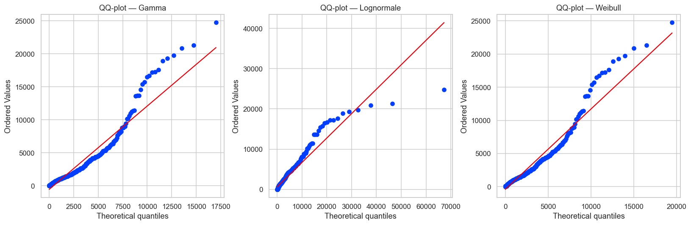
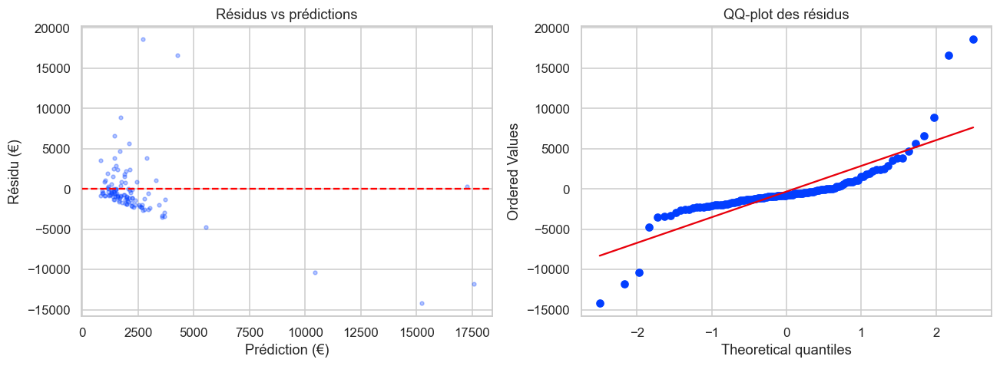
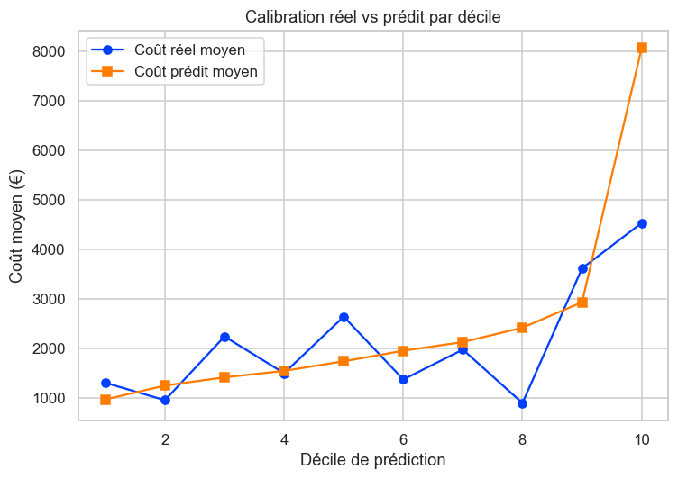
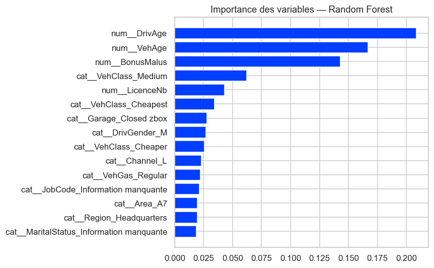
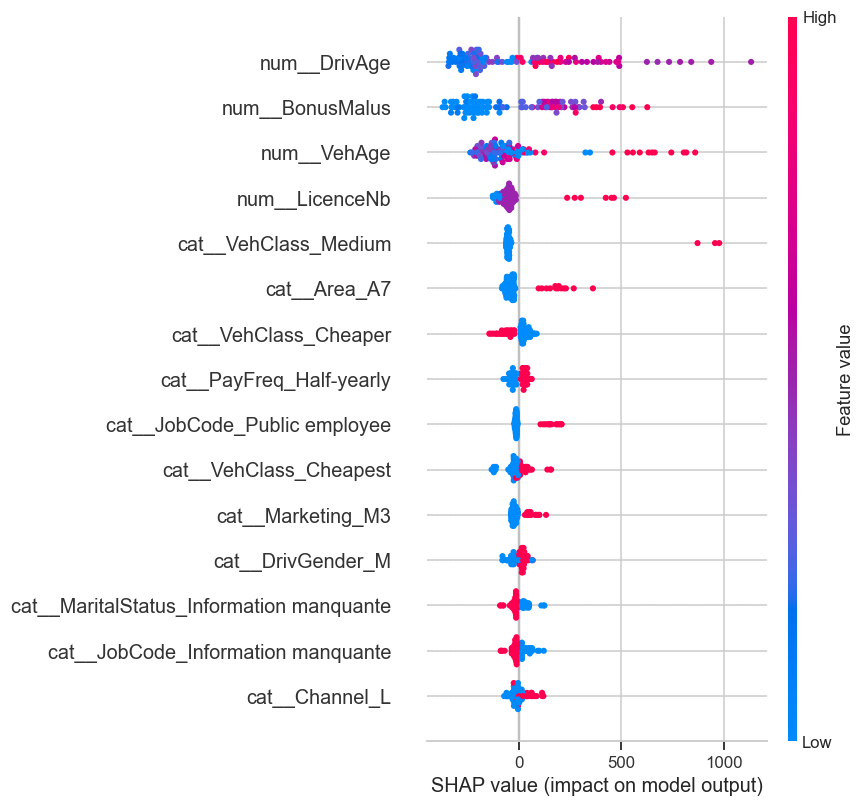

# Prédiction du coût des sinistres automobiles (sévérité)

Projet de Data Science actuarielle visant à modéliser le **coût des sinistres automobiles** (garantie Dommage) à partir des caractéristiques de l'assuré, du véhicule et du contrat.

---

## Sommaire

- [🔑 Key Findings](#-key-findings)
- [1. Problème métier](#1-problème-métier)
- [2. Pourquoi ce jeu de données](#2-pourquoi-ce-jeu-de-données)
- [3. Démarche](#3-démarche)
- [4. Résultats et insights](#4-résultats-et-insights)
- [5. Recommandations](#5-recommandations)
- [6. Pistes d'amélioration](#6-pistes-damélioration)
- [ Technologies utilisées](#️-technologies-utilisées)

---

## 🔑 Key Findings

>  Aucun modèle ne domine sur toutes les métriques (XGBoost gagne en MAE/RMSE/R², le GLM Gamma gagne en déviance Gamma), et surtout, **le modèle sous-estime fortement les sinistres les plus coûteux** (P99+ : coût réel moyen 21 083 € vs. coût prédit 3 489 €), ce qui constitue l'enseignement actuariel le plus important du projet.

| | |
|---|---|
| **Sinistres modélisés** | 729 (garantie Damage) |
| **Coût moyen / médian** | 2 091 € / 1 139 € (skewness 3,65 → forte asymétrie) |
| **Meilleur modèle (MAE/RMSE/R²)** | XGBoost |
| **Meilleur modèle (déviance Gamma)** | GLM Gamma |
| **Limite principale** | Sous-estimation des sinistres extrêmes (P95+/P99+) |
| **Best fit distribution** | Weibull (AIC 12 557) |

---

## 1. Problème métier

En assurance non-vie, deux profils d'assurés en apparence similaires peuvent générer des sinistres dont les coûts diffèrent fortement. L'enjeu métier est double :

> **Estimer le coût attendu d'un sinistre à partir du profil de l'assuré, pour améliorer la connaissance du risque et la tarification**, et **identifier les facteurs associés aux sinistres les plus coûteux**, ceux qui pèsent le plus sur le résultat technique d'un assureur.

Ce projet s'inscrit dans une logique de **tarification et de segmentation du risque** : la variable cible est le montant payé (`Payment`) sur la garantie Damage, mise en relation avec la prime correspondante (`PremDamAll`).

## 2. Pourquoi ce jeu de données

Le jeu de données combine deux tables complémentaires, typiques d'un contexte actuariel réel :
- une **table de sévérité** (9 246 sinistres, 5 variables : identifiants, date, garantie, montant) ;
- une **table de primes** (51 949 lignes contrat-année, 30 variables : profil du conducteur, du véhicule, du contrat, canal, marketing).

Il permet de relier directement **profil assuré + véhicule + contrat → coût du sinistre**, ce qui en fait un cas d'usage réaliste de modélisation de la sévérité. Un travail de granularité a été nécessaire pour ramener les primes à une ligne par contrat-année et la sévérité à une ligne par sinistre, avant jointure sur `IDpol` et l'année. Après filtrage sur la garantie Damage et suppression des paiements nuls, la base finale de modélisation comprend **729 sinistres et 21 variables**, sans valeur manquante.

## 3. Démarche

1. **Chargement et audit qualité** des deux tables (`.rda`), avec un fort taux de valeurs manquantes sur `MaritalStatus` et `JobCode` (67 %), traité par la catégorie `"Information manquante"`.
2. **Harmonisation de la granularité** et **jointure** primes / sévérité pour construire la base de modélisation.
3. **Analyse exploratoire des coûts** : la distribution est **très asymétrique** (moyenne 2 091 €, médiane 1 139 €, skewness 3,65), justifiant une transformation logarithmique (skewness ramenée à -0,55) et l'usage de modèles adaptés aux distributions positives.
4. **Ajustement de distributions théoriques** (Gamma, Lognormale, Weibull, Exponentielle) comparées par AIC/BIC :

   

   La **Weibull** obtient le meilleur ajustement (AIC 12 557), suivie de près par la Lognormale. Les QQ-plots montrent cependant que même la meilleure distribution théorique peine à capturer la queue extrême des coûts, un signal avant-coureur de la difficulté rencontrée plus tard par les modèles prédictifs.

5. **Tests statistiques** sur les facteurs explicatifs : corrélation de **Spearman** (`LicenceNb` seule variable numérique significative, ρ = 0,116, p = 0,002) et test de **Kruskal-Wallis** (`VehPower` seule variable catégorielle significative au seuil de 5 %, p = 0,029).
6. **Traitement des gros sinistres** : plutôt que de les supprimer comme des anomalies, ils ont été conservés, un sinistre à 15 000 € est un événement rare mais réel, faisant partie intégrante du risque à modéliser. Une winsorisation au P99 a été testée à titre de comparaison (seulement 1,1 % des observations concernées).
7. **Modélisation** avec split train/validation/test (70/15/15) et comparaison de 5 approches : baseline (moyenne), **GLM Gamma** (lien log), **régression Lognormale** (avec correction de Duan), **Random Forest**, **XGBoost**.
8. **Interprétation** : effets multiplicatifs du GLM (exp(coefficients)), importance des variables (Random Forest), analyse SHAP, puis **validation actuarielle par décile** et **analyse des résidus par segment de coût**.

## 4. Résultats et insights

### Comparaison des modèles

| Modèle | MAE (€) | RMSE (€) | Déviance Gamma | R² |
|---|---:|---:|---:|---:|
| GLM Gamma | 2 134 | 3 732 | **1,650** | -0,110 |
| Lognormale (Duan) | 2 335 | 4 301 | 1,728 | -0,474 |
| Baseline (moyenne) | 2 044 | 3 542 | 1,753 | ≈ 0 |
| Random Forest | 1 984 | 3 522 | 1,763 | 0,011 |
| XGBoost | **1 626** | **3 423** | 3,522 | **0,066** |

**Aucun modèle ne domine sur toutes les métriques**, et c'est en soi l'un des enseignements du projet : XGBoost minimise le MAE/RMSE et maximise le R², mais le GLM Gamma reste supérieur sur la **déviance Gamma**, la métrique la plus alignée avec la structure statistique réelle des coûts de sinistres. Le choix du modèle dépend donc de l'objectif : performance brute de prédiction (XGBoost) vs. cohérence actuarielle et interprétabilité (GLM Gamma). C'est le GLM Gamma qui a été retenu pour l'analyse des résidus, en raison de sa pertinence pour cette problématique de sévérité et de sa capacité à produire des effets directement interprétables.

### ⚠️ L'enseignement le plus important : la sous-estimation des sinistres extrêmes

L'analyse des résidus par segment révèle une limite majeure, avec un enjeu financier direct pour l'assureur :

| Segment | Coût réel moyen | Coût prédit moyen (GLM Gamma) |
|---|---:|---:|
| Tous | 2 100 € | 2 438 € |
| P90+ | 10 435 € | 5 020 € |
| P95+ | 14 364 € | 4 914 € |
| P99+ | 21 083 € | 3 489 € |

**Le modèle sous-estime fortement les sinistres les plus coûteux** : pour le P99+, le coût réel moyen (21 083 €) est près de **6 fois supérieur** au coût prédit (3 489 €).

Cette faiblesse se confirme dans la validation par décile, le modèle doit non seulement être précis en moyenne, mais aussi **ordonner correctement les risques**, propriété essentielle pour la segmentation tarifaire :

Sur le dernier décile de prédiction, le coût réel moyen observé (4 527 €) est très inférieur au coût prédit moyen (8 055 €), signe d'une calibration imparfaite dans les segments extrêmes. **C'est le point le plus important d'un point de vue actuariel** : une bonne performance moyenne peut masquer une mauvaise capture des risques les plus coûteux, précisément ceux qui pèsent le plus sur le résultat technique.

### Facteurs explicatifs

- **Le pouvoir explicatif global reste limité** (R² du meilleur modèle : 0,066) — une large part de la variabilité des coûts n'est pas expliquée par les variables disponibles, ce qui est cohérent avec la nature des sinistres (facteurs souvent absents des données : circonstances précises, météo, type de dommage).
- **`DrivAge`, `VehAge` et `BonusMalus`** ressortent comme les variables les plus influentes selon le Random Forest et SHAP, malgré une significativité limitée en test univarié, signe d'effets combinés/non-linéaires mieux captés par les modèles d'ensemble que par les tests marginaux.
- **`VehPower`** (puissance du véhicule) reste le facteur le plus robuste statistiquement (Kruskal-Wallis significatif).
- Le GLM Gamma met en évidence des effets multiplicatifs significatifs sur certaines modalités de **Garage** et **Marketing**.

## 5. Recommandations

1. **Ne pas traiter les gros sinistres comme des anomalies à supprimer**, ils représentent une composante structurelle du risque et doivent être modélisés, pas exclus.
2. **Traiter spécifiquement la queue de distribution** : combiner un modèle de sévérité principal avec une approche dédiée aux valeurs extrêmes (théorie des valeurs extrêmes, modèle Peaks Over Threshold, distribution de Pareto au-delà d'un seuil), plutôt que de chercher un modèle unique performant partout.
3. **Enrichir les données** : le R² limité suggère que des variables clés manquent (circonstances du sinistre, franchise, type de dommage, historique de sinistralité, données météo, coût de réparation).
4. **Ne pas choisir un modèle sur une seule métrique** : conserver le GLM Gamma comme référence actuarielle (interprétabilité, cohérence statistique, communication métier) et utiliser un modèle Machine Learning (XGBoost) comme **challenger** pour évaluer le potentiel de gain en précision.
5. **Envisager une approche hybride** : GLM pour l'interprétabilité et la gouvernance actuarielle, modèle ML pour capter les non-linéarités, les deux se complètent plus qu'ils ne s'opposent.

## 6. Pistes d'amélioration

- Historique temporel plus long pour permettre un split train/test réellement temporel (entraînement sur le passé, validation sur le futur) plutôt qu'aléatoire.
- Optimisation des hyperparamètres (Random Forest, XGBoost) avec validation croisée.

---

## Technologies utilisées

**Python** · Pandas · NumPy · SciPy · Matplotlib · Seaborn · Scikit-learn · Statsmodels · XGBoost · SHAP · Pyreadr

**Méthodes statistiques** : AIC/BIC, QQ-plots, corrélation de Spearman, test de Kruskal-Wallis, GLM Gamma, régression Lognormale, correction de Duan (smearing)

**Machine Learning** : Random Forest, XGBoost, encodage One-Hot, analyse SHAP, validation par décile

---

